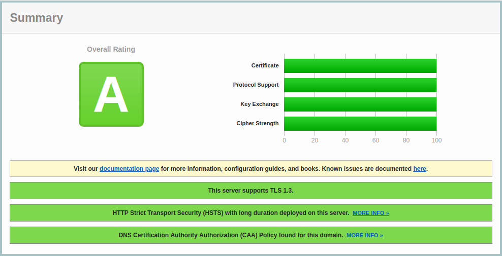

# haproxy-script
Script to install containerized haproxy with letsencrypt cert



## Prerequisites
- Debian 12 server with sudo, git, docker (https://github.com/MystixCode/server-script)
- A domain name configured with dns record type A pointing to your WAN IP. For example:

  | Domain  | WAN IP |
  | ------------- | ------------- |
  | example.dev  | 142.250.203.110  |
  | sub1.example.dev  | 142.250.203.110  |
  | sub2.example.dev  | 142.250.203.110  |

 - (optional) CAA dns record pointing to letsencrypt.org. For example:

    | Domain  | letsencrypt domain |
    | ------------- | ------------- |
    | example.dev  | letsencrypt.org  |
    | sub1.example.dev  | letsencrypt.org  |
    | sub2.example.dev  | letsencrypt.org  |
  
- On your router: port forwarding for http port 80 and https port 443 and letsencrypt port 8443 to your debian server.


## Build and run

### Staging

```bash
if [ -n "$(docker ps -q -f name=haproxy)" ]; then docker kill haproxy; fi && \
if [ -n "$(docker ps -a -q -f name=haproxy)" ]; then docker rm haproxy; fi && \
if [ -n "$(docker images -q haproxy-img)" ]; then docker rmi haproxy-img; fi && \
docker volume rm conf -f && \
docker volume rm tls -f && \
docker build -t haproxy-img -f Dockerfile . && \
docker run --rm --name haproxy \
-v conf:/usr/local/etc/haproxy \
-v tls:/etc/ssl/private \
-it \
-p 7777:7777 \
-p 80:80 \
-p 443:443 \
-p 8443:8443 \
haproxy-img \
"example.dev,info@example.dev,192.168.1.100:3000,192.168.1.101:3000" \
"sub1.example.dev,sub1@example.dev,192.168.1.100:4000,192.168.1.101:4000"
```

### Prod

```bash
if [ -n "$(docker ps -q -f name=haproxy)" ]; then docker kill haproxy; fi && \
if [ -n "$(docker ps -a -q -f name=haproxy)" ]; then docker rm haproxy; fi && \
if [ -n "$(docker images -q haproxy-img)" ]; then docker rmi haproxy-img; fi && \
docker volume rm conf -f && \
docker volume rm tls -f && \
docker build -t haproxy-img -f Dockerfile . && \
docker run --rm --name haproxy \
-v conf:/usr/local/etc/haproxy \
-v tls:/etc/ssl/private \
-it \
-p 7777:7777 \
-p 80:80 \
-p 443:443 \
-p 8443:8443 \
haproxy-img \
--prod "example.dev,info@example.dev,192.168.1.100:3000,192.168.1.101:3000" \
"sub1.example.dev,sub1@example.dev,192.168.1.100:4000,192.168.1.101:4000"
```

## Additional info:

Copy the dh-key to local:
```bash
docker cp haproxy:/usr/local/etc/haproxy/dhparams.pem /home/$USER/git/haproxy-script/conf/
```

Copy the certs to local:
```bash
docker cp haproxy:/etc/ssl/private/. /home/$USER/git/haproxy-script/tls

# Then uncomment following line in Dockerfiile. Then it will use those.
# COPY ./tls/* /etc/ssl/private/
```

Access the volumes on the server like this:
```bash
sudo ls -l /var/lib/docker/volumes/copy/_data
sudo ls -l /var/lib/docker/volumes/tls/_data
```

Access the haproxy container like this:
```bash
docker exec -it haproxy /bin/bash
```

Run a command in the container like this:
```bash
docker exec -it haproxy cat /usr/local/etc/haproxy/haproxy.cfg
```

Check the ocsp response like this:
```bash
echo quit | openssl s_client -connect <your.domain>:443 -status
```

Show haproxy info:
```bash
echo "show info" | socat stdio /run/haproxy/admin.sock
```

Show haproxy cache:
```bash
echo "show cache" | socat stdio /run/haproxy/admin.sock
```

Reload: #TODO: why this not working?
```bash
echo "reload" | socat stdio /run/haproxy/admin.sock
```
